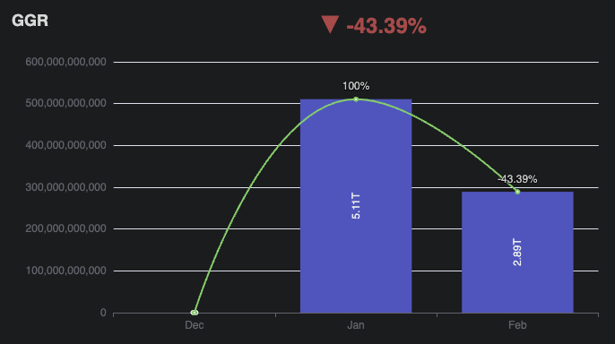

# Assignment

## Scenario

You are a dashboard developer. Often, your boss isn't quite sure what exactly they want to see on the screen, but they will give you the key features they desire the most.

## Requirements

Please extend [this Vue admin template](https://github.com/kailong321200875/vue-element-plus-admin).

Using the Node.js mock API included with the project, create a simple dashboard page. This API provides monthly summaries for partners and games for the entire year of 2020.

Implement the following features:

1. Toolbar with the following search capabilities:

   - Month (January 2020 ~ December 2020)
   - Multi-select for partners (partner_code_1, ... so on)
   - Multi-select for games (game_id_1, ... so on)

2. Charts:

   - Display a chart and trend graph showing the GGR amounts for the past 3 months from the selected month.
     Example:
     
   - Show the Top 3 Games for Stakes in the selected month.
   - Show the Top 3 Partners for ARPU in the selected month.

3. Table:
   - Display the data in a table format that can be sorted by Stakes, GGR, Players, Spins, RTP.

## Bonus Points

- Modify the theme template according to your aesthetic to provide a more design-oriented UI.
- Provide additional information that users might want to know and design a user-friendly interface.

# Delivery

Please upload the project to your own Git repository and add me (z20240z@gmail.com) to the repository. I will check it myself.
